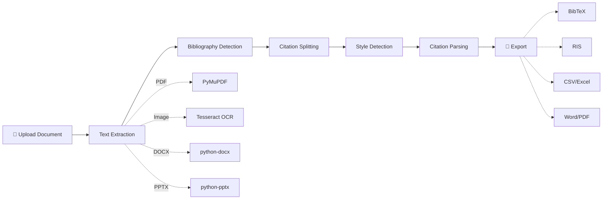

# 🌿 PaperMint

**Extract, parse, and export academic citations from PDFs, images, and documents.**

[](https://www.python.org/downloads/)
[](LICENSE)
[](https://streamlit.io)

---

## The Problem

Students and researchers spend hours manually formatting citations. They copy-paste from PDFs, re-type references, and wrestle with BibTeX formatting — all by hand.

**PaperMint automates this.** Upload a document, and PaperMint extracts every citation, detects the citation style, parses each reference into structured fields, and exports them in whatever format you need — BibTeX, RIS, CSV, Word, or PDF.

---

## ✨ Features

| Feature | Description |
|:---|:---|
| 📄 **Multi-Format Input** | Upload PDFs, images (PNG/JPG with OCR), Word (.docx), and PowerPoint (.pptx) |
| 🔍 **Bibliography Detection** | Automatically finds the "References" / "Bibliography" section in your document |
| 🎯 **Citation Style Auto-Detection** | Identifies APA, MLA, IEEE, and Chicago citation styles with confidence scores |
| 🧠 **Smart Parsing** | Multi-strategy extraction: regex patterns + spaCy NLP + heuristic fallbacks |
| 📊 **Confidence Scoring** | Each extracted citation gets a confidence score so you know what to double-check |
| 🔗 **DOI Lookup** | Enter a DOI and fetch complete citation metadata from the CrossRef API |
| 📁 **Batch Processing** | Upload multiple documents and extract all citations at once |
| 📝 **Smart Summarization** | TextRank-based extractive summarization (not just "first 2 sentences") |
| 💾 **Export Anywhere** | BibTeX, RIS (importable into Zotero/Mendeley), CSV, Excel, Word, PDF |

---

## 🛠️ Tech Stack

| Layer | Technology |
|:---|:---|
| **Frontend** | Streamlit (multipage navigation) |
| **NLP** | spaCy + PyTextRank |
| **PDF Processing** | PyMuPDF |
| **OCR** | Tesseract via pytesseract |
| **Document Parsing** | python-docx, python-pptx |
| **Data Models** | Pydantic v2 |
| **API Integration** | CrossRef via habanero |
| **Export** | bibtexparser, ReportLab, openpyxl |
| **Testing** | pytest |

---

## 🏗️ Architecture



---

## 🚀 Quick Start

### Prerequisites
- Python 3.10 or higher
- Tesseract OCR (for image processing)

### Installation

```bash
# Clone the repository
git clone https://github.com/Akki-333/PaperMint.git
cd PaperMint

# Create virtual environment
python -m venv .venv

# Activate (Windows)
.\.venv\Scripts\activate
# Activate (macOS/Linux)
source .venv/bin/activate

# Install dependencies
pip install -e .

# Download the spaCy language model
python -m spacy download en_core_web_sm
```

### Install Tesseract (Required for OCR)
- **Windows**: Download from [tesseract-ocr](https://github.com/UB-Mannheim/tesseract/wiki)
- **macOS**: `brew install tesseract`
- **Linux**: `sudo apt-get install tesseract-ocr`

### Run the App

```bash
streamlit run app.py
```

The app opens at `http://localhost:8501` 🎉

---

## 📖 Usage

### Extract Citations
1. Navigate to **Extract Citations** page
2. Upload your document (PDF, image, DOCX, or PPTX)
3. PaperMint automatically:
   - Extracts text from the document
   - Detects the bibliography section
   - Splits individual citations
   - Detects the citation style (APA, MLA, IEEE, Chicago)
   - Parses each citation into structured fields
4. Review extracted citations with confidence scores
5. Export in your preferred format

### DOI Lookup
1. Navigate to **DOI Lookup** page
2. Enter a DOI (e.g., `10.1038/s41586-020-2649-2`)
3. Get complete citation metadata from CrossRef
4. Export the citation

### Batch Processing
1. Navigate to **Batch Processing** page
2. Upload multiple documents at once
3. All citations are extracted and aggregated
4. Bulk export all citations

---

## 📂 Project Structure

```
PaperMint/
├── app.py                         # Streamlit entry point (thin router)
├── pyproject.toml                 # Modern Python packaging
├── packages.txt                   # System deps for Streamlit Cloud
├── LICENSE                        # MIT License
├── papermint/                     # Core Python package
│   ├── config.py                  # App constants & settings
│   ├── models.py                  # Pydantic data models
│   ├── extractors/                # Text extraction by file format
│   │   ├── pdf_extractor.py
│   │   ├── image_extractor.py
│   │   ├── docx_extractor.py
│   │   └── pptx_extractor.py
│   ├── parsers/                   # Citation parsing & NLP
│   │   ├── bibliography_detector.py
│   │   ├── citation_splitter.py
│   │   ├── style_detector.py
│   │   ├── citation_parser.py
│   │   └── summarizer.py
│   ├── enrichment/                # External API integrations
│   │   └── crossref.py
│   ├── exporters/                 # Output format generators
│   │   ├── bibtex_exporter.py
│   │   ├── ris_exporter.py
│   │   ├── csv_exporter.py
│   │   ├── docx_exporter.py
│   │   └── pdf_exporter.py
│   └── ui/                        # Streamlit UI layer
│       ├── styles.py
│       ├── pages/
│       │   ├── extract.py
│       │   ├── batch.py
│       │   ├── doi_lookup.py
│       │   └── about.py
│       └── components/
│           ├── citation_card.py
│           ├── file_uploader.py
│           ├── export_panel.py
│           └── progress.py
└── tests/                         # Test suite
    ├── conftest.py
    ├── test_models.py
    ├── test_parsers.py
    ├── test_exporters.py
    └── test_enrichment.py
```

---

## 🧪 Development

### Install Dev Dependencies
```bash
pip install -e ".[dev]"
```

### Run Tests
```bash
pytest --cov=papermint
```

### Lint
```bash
ruff check papermint/
```

---

## 🌐 Deployment (Streamlit Cloud)

1. Push your code to GitHub
2. Go to [share.streamlit.io](https://share.streamlit.io)
3. Connect your GitHub account
4. Select your repository and `app.py`
5. Click **Deploy**

The `packages.txt` file ensures Tesseract is installed on the server.

---

## 🤝 Contributing

Contributions are welcome!

1. Fork the repository
2. Create your feature branch (`git checkout -b feature/amazing-feature`)
3. Commit your changes (`git commit -m 'feat: add amazing feature'`)
4. Push to the branch (`git push origin feature/amazing-feature`)
5. Open a Pull Request

---

## 📄 License

This project is licensed under the MIT License — see the [LICENSE](LICENSE) file for details.

---

## 🙏 Acknowledgments

- [Streamlit](https://streamlit.io) — Web app framework
- [spaCy](https://spacy.io) — NLP library
- [PyMuPDF](https://pymupdf.readthedocs.io) — PDF processing
- [CrossRef](https://www.crossref.org/) — DOI metadata API
- [PyTextRank](https://derwen.ai/docs/ptr/) — TextRank summarization
- [Tesseract](https://github.com/UB-Mannheim/tesseract/wiki) — OCR engine

---

Made with 🌿 by [Akki](https://github.com/Akki-333)
