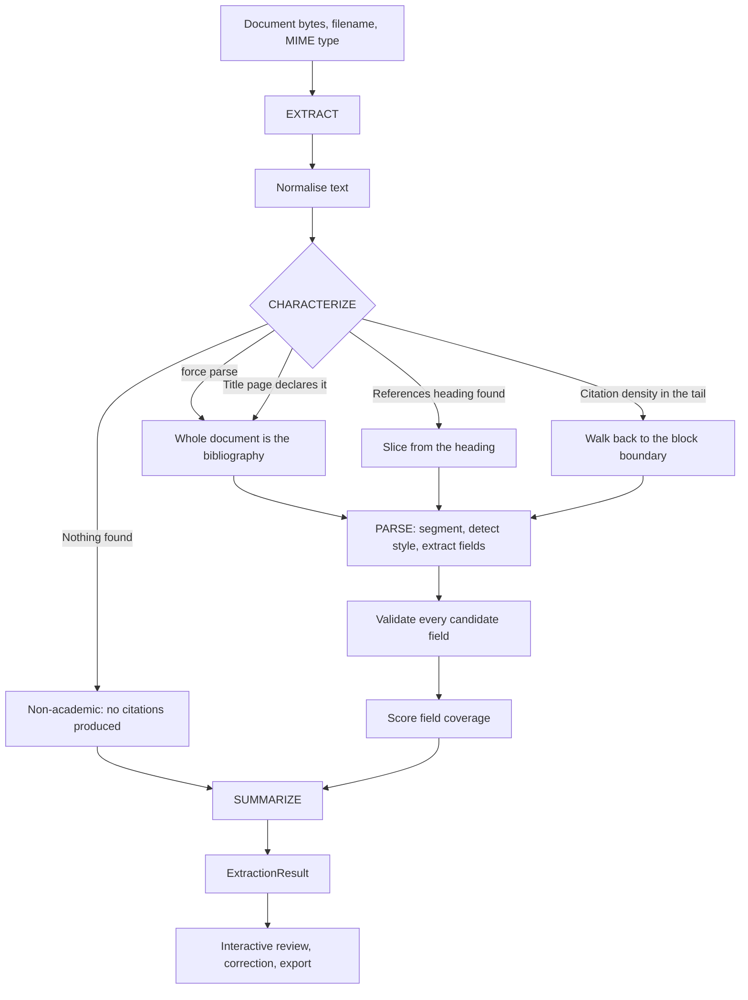

# PaperMint — System Architecture

## 1. What this system is

PaperMint turns unstructured academic documents (PDF, Word, PowerPoint, scanned
images) into structured, exportable bibliographic records, with a document
summary and optional CrossRef enrichment.

Its governing principle is **honesty over completeness**: a field that cannot be
read confidently is left empty and reported as missing, never filled with a
plausible-looking fragment.

---

## 2. The four layers

```
┌──────────────────────────────────────────────────────────────────────────┐
│  PRESENTATION            papermint/ui/                     app.py        │
│  Streamlit only. Captures gestures, holds session state, renders.        │
│  theme.py · icons.py · html.py · styles.py · navigation.py               │
│  components/ (primitives, citation_card, export_panel, progress, …)      │
│  pages/ (home, extract, batch, doi_lookup, about)                        │
└───────────────────────────────────┬──────────────────────────────────────┘
                                    │ DocumentInput / PipelineOptions
                                    ▼
┌──────────────────────────────────────────────────────────────────────────┐
│  ORCHESTRATION           papermint/pipeline.py                           │
│  PipelineService: sequences the stages, isolates errors, reports         │
│  progress, and returns a fully populated result.                         │
└───────────────────────────────────┬──────────────────────────────────────┘
                                    │
                                    ▼
┌──────────────────────────────────────────────────────────────────────────┐
│  DOMAIN ENGINES                                                          │
│  extractors/  registry · pdf · image · docx · pptx                       │
│  parsers/     text_normalizer · bibliography_detector · citation_splitter│
│               citation_parser · style_detector · summarizer              │
│  enrichment/  crossref                                                   │
│  exporters/   bibtex · ris · csv · docx · pdf                            │
└───────────────────────────────────┬──────────────────────────────────────┘
                                    │
                                    ▼
┌──────────────────────────────────────────────────────────────────────────┐
│  DATA MODEL              papermint/models.py · errors.py · config.py     │
│  Author · Citation · ExtractionResult · BatchResult · DocumentStats      │
│  CitationStyle · EntryType · ConfidenceBand · DocumentKind ·             │
│  DetectionMethod · PaperMintError hierarchy                              │
└──────────────────────────────────────────────────────────────────────────┘
```

### 2.1 The zero-Streamlit rule

Streamlit imports are confined to `papermint/ui/` and `app.py`. Everything below
the orchestration layer is plain Python and runs headless.

This is **enforced, not documented**: `tests/test_architecture.py` parses every
module with `ast` and fails the build if a domain module imports Streamlit,
imports the presentation layer, calls `print()`, uses a bare `except`, omits
`from __future__ import annotations`, or leaves a public definition
undocumented.

`papermint/cli.py` is the standing proof. It runs the identical
`PipelineService` from a terminal with no Streamlit process anywhere.

### 2.2 The service facade

Pages never import parsers or individual extractors. They import
`papermint.pipeline` and nothing deeper. Metadata the interface needs, such as
which formats are accepted, is re-exported through `accepted_formats()` and
`accepted_extensions()` so the boundary holds even for trivia. This too is
enforced by an architecture test.

---

## 3. The pipeline

`PipelineStage` defines the sequence, and the interface's stepper is driven from
that same enum, so the displayed steps cannot drift from the executed ones.



### Stage 1 — EXTRACT

`resolve_extractor()` picks a decoder by MIME type, falling back to the filename
extension. The decoder returns text, a real page count and any non-fatal
warnings. Failures raise `CorruptedDocumentError`, `UnsupportedFileTypeError` or
`OcrUnavailableError` rather than returning an empty string.

The text is then normalised by `parsers/text_normalizer.py`, which is what makes
the difference between clean output and broken output:

| Problem in raw PDF text | Repair |
|:---|:---|
| Typographic ligatures | Unicode NFKC folding |
| Soft hyphens, zero-width characters | Removed |
| Words split across a line break | Rejoined, lowercase to lowercase only |
| Six different dash characters | Mapped to the ASCII hyphen |
| Curly quotes | Mapped to straight quotes |
| Bare page numbers on their own line | Dropped |
| Repeated running headers and footers | Dropped by repetition frequency |

### Stage 2 — CHARACTERIZE

`characterize_document()` returns a `DetectionOutcome` carrying the bibliography
block, the remaining body text, the `DetectionMethod` used, the `DocumentKind`,
a confidence score and human-readable reasoning the interface displays.

Strategies run in descending order of reliability: reader override, title page,
section heading (the **last** match, so a table of contents cannot win), then a
backwards density scan that stops at the first sustained run of prose.

### Stage 3 — PARSE

`split_citations()` tries numbered prefixes, blank lines, hanging indent and
author boundaries, **validating each candidate split** before accepting it, and
merging continuation fragments. A split that yields mostly non-citation
fragments is rejected in favour of the next strategy.

`parse_citation()` extracts eight fields. Every extractor proposes candidates in
order of reliability and then validates them. A title candidate is rejected if
it is a page locator, an author list, a DOI, a URL or a publisher string; a page
range is rejected if it is a span of two four-digit calendar years.

### Stage 4 — SUMMARIZE

Reference lines are stripped, then sentences are scored by normalised
content-word frequency with a positional boost for openings and conclusions.
spaCy is used when present and a deterministic regex segmenter when it is not. A
document that is itself a reference list gets a factual description rather than
its own citations read back to it.

---

## 4. Quality attributes

| Attribute | Target | How it is enforced |
|:---|:---|:---|
| Deterministic reliability | Full suite green | 345 tests, including 223 architectural conformance checks |
| No fabricated data | Zero citations from non-bibliographic documents | `test_pipeline_invents_no_citations_for_prose` |
| Graceful degradation | No unhandled exception reaches a page | Typed `PaperMintError` hierarchy; every page renders under `AppTest` |
| Framework independence | Engine runs with no Streamlit | `papermint/cli.py` plus `ast`-based import checks |
| Optional dependencies | Runs without spaCy | Regex segmenter fallback; a CI job omits the model deliberately |
| Responsiveness | Reprocessing only on real change | Results cached in session state against a content digest |
