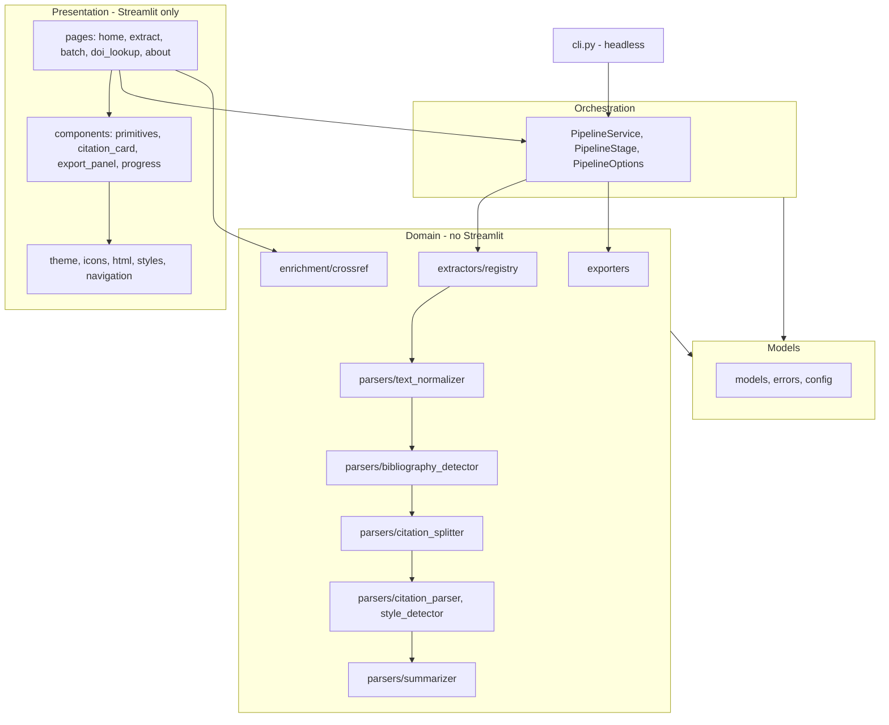

# PaperMint — Technical Documentation

The specification suite for PaperMint: what the system is, how it behaves for
each kind of document, the standards its code is held to, and how it looks.

---

## Index

| Document | Answers |
|:---|:---|
| **[Architecture Blueprint](ARCHITECTURE_BLUEPRINT.md)** | What are the layers, what runs in what order, and what stops the layers leaking into one another |
| **[Workflow Specifications](WORKFLOW_SPECIFICATION.md)** | What happens to a research paper, an annotated bibliography, a headerless reference list, a general document, a batch, and a DOI |
| **[Engineering Standards](ENGINEERING_STANDARDS.md)** | What the code must do, and which test enforces each rule |
| **[Design System](UI_UX_BLUEPRINT.md)** | Tokens, card anatomy, confidence display, and what is deliberately absent |
| **[Implementation Roadmap](IMPLEMENTATION_ROADMAP.md)** | What is finished, what is next, and what each phase was verified against |
| **[Deployment Guide](DEPLOYMENT_GUIDE.md)** | Container and hosting reference. Currently out of scope |

---

## Where to start

- **Changing how a citation is parsed** — Engineering Standards section 5, then
  `papermint/parsers/citation_parser.py`. The governing rule is propose, then
  validate.
- **Changing how something looks** — the Design System, then
  `papermint/ui/theme.py`. Never a literal colour in a component.
- **Adding a document format** — write an extractor against `BaseExtractor` and
  register it in `papermint/extractors/registry.py`. Nothing else changes; the
  upload widget and the About page both read the registry.
- **Understanding a branch the app took** — Workflow Specifications. The app
  also tells you directly, under "How this document was read".

---

## Architecture at a glance



The rule that matters: **nothing inside Domain or Models imports Streamlit, and
no page imports past `PipelineService`.** `papermint/cli.py` proves it at
runtime and `tests/test_architecture.py` proves it statically on every run.

---

## Verification

```
ruff check .            # explicit rule set pinned in pyproject.toml
ruff format --check .
pytest                  # 345 tests
```

| Suite | Tests |
|:---|---:|
| Architecture conformance | 223 |
| Presentation | 30 |
| Parsers | 25 |
| Normalisation and parser guards | 26 |
| Orchestration and CLI | 18 |
| Models | 11 |
| Exporters | 7 |
| Enrichment | 5 |
