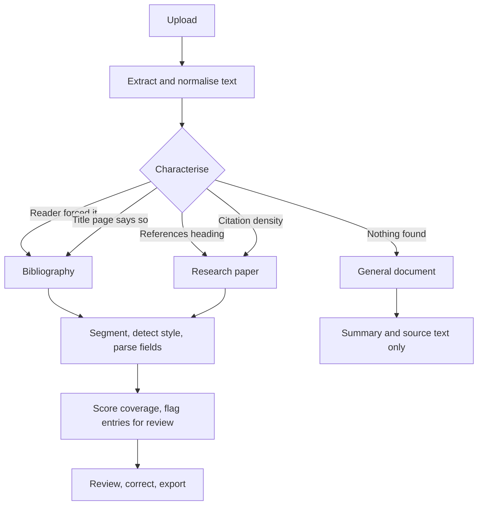

# PaperMint — Workflow Specifications

Every document takes one of four branches, and the branch taken is always shown
to the reader with its reasoning. Nothing here is aspirational; each workflow
below names the test that covers it.

---

## Workflow 1 — Research paper

**Documents.** Journal articles, conference papers, preprints, theses: a
narrative body followed by a references section.

**Flow.**

1. The extractor decodes the file and reports a real page count.
2. Normalisation repairs ligatures, hyphenated line breaks and page furniture.
3. `characterize_document()` matches a references heading on a line of its own,
   taking the **last** match so a table of contents entry cannot win, and splits
   the document into body and bibliography.
4. `split_citations()` segments the block; the split is validated before it is
   accepted.
5. `detect_style()` scores APA, MLA, IEEE and Chicago signals.
6. `parse_citation()` extracts eight fields per entry, validating each.
7. The summariser runs on the body only, so publisher names and author initials
   cannot contaminate the summary.

**What the reader sees.** A positive notice naming the document kind and the
detection method; four statistics tiles; the References, Summary and Source text
tabs; the export panel.

**Covered by.** `test_pipeline_parses_a_research_paper`

---

## Workflow 2 — Annotated bibliography

**Documents.** Literature guides and subject catalogues where each citation is
followed by one or more paragraphs of commentary.

**Flow.**

1. Detection recognises the document from its first line, or the reader enables
   **Treat the whole document as a bibliography** under Options.
2. `_looks_annotated()` inspects the entry blocks: when a meaningful share carry
   40 words or more of trailing prose, the kind becomes
   `ANNOTATED_BIBLIOGRAPHY`.
3. Segmentation splits on author boundaries, keeping each citation and its
   annotation together as one unit. Surnames with particles, hyphens,
   apostrophes and all-caps forms are all recognised.
4. `_split_header()` isolates the citation header from the annotation before any
   field is extracted. This is what stops a quoted phrase inside the commentary
   from becoming the title.
5. All-capitals titles, common in mid-century catalogues, are matched by a
   dedicated strategy that still rejects publisher forms such as `MACMILLAN CO`.

**What the reader sees.** Correct titles and authors. The Summary tab states
that the document is a reference catalogue rather than reading its own citations
back as a summary.

**Covered by.** `test_pipeline_honours_force_parse`, plus the annotated-entry
cases in `tests/test_normalization.py`.

---

## Workflow 3 — Reference list with no heading

**Documents.** A bibliography pasted without a `References` line, or a paper
whose heading did not survive extraction.

**Flow.**

1. No heading matches, so the density scan runs over the trailing half.
2. When density passes the threshold, the scan walks **backwards from the end**,
   extending while reference-like lines appear and tolerating up to four
   consecutive continuation lines, then stopping at the first sustained run of
   prose.
3. The selected block must itself pass the density check before it is accepted.

This is a correctness change, not a refinement: the previous implementation
returned the entire trailing half of the document, so the closing paragraphs of
the body were parsed as citations.

**What the reader sees.** The detection method is reported as "Detected by
citation density", with the measured percentage.

---

## Workflow 4 — General document

**Documents.** Policies, reports, essays, stories: no bibliography at all.

**Flow.** No heading, no title-page declaration, no density. Detection returns
`NON_ACADEMIC` with no bibliography text, and the parse stage is skipped
entirely.

**What the reader sees.** An informational notice explaining that PaperMint
found no references and therefore invented none, with a pointer to the
force-parse option in case the classification is wrong. The References tab and
the export panel are hidden rather than shown empty; the reader lands on Summary
and Source text.

**Covered by.** `test_pipeline_invents_no_citations_for_prose`

---

## Workflow 5 — Batch processing

**Flow.**

1. Several files are handed to `process_batch()` in one call.
2. Each file runs the full single-document pipeline.
3. A failure is caught, recorded against that file with its error kind, and the
   run continues.
4. Results are cached against a digest of the whole uploaded set, so opening a
   per-file panel reprocesses nothing.

**What the reader sees.** A notice stating how many of how many files succeeded;
tiles for files, references, mean coverage and elapsed time; one expandable
panel per file; and a merged export across every file that succeeded.

**Covered by.** `test_batch_isolates_a_failing_file`, `test_batch_reports_progress`

---

## Workflow 6 — DOI lookup

**Flow.**

1. The reader pastes an identifier. `normalize_doi()` strips a
   `https://doi.org/` or `doi:` prefix.
2. CrossRef is queried through `habanero`.
3. A DOI that is genuinely absent returns `None`; an unreachable CrossRef raises
   `CrossRefNetworkError`. These are different situations and produce different
   notices.
4. The record maps onto the same `Citation` model at full confidence, including
   the CrossRef work type.

**What the reader sees.** A citation card identical in form to a parsed one, a
field-by-field record, the raw JSON, and the export panel. The result is held in
session state so it survives reruns.

---

## Workflow 7 — Review and correction

**Flow.**

1. Entries scoring below 50% are flagged, and the "Needs review" toggle filters
   to exactly those.
2. Every card carries an inline editor for all eight fields.
3. On save, the citation is copied with the new values, marked as edited, and
   rescored by `score_citation()`.
4. The edit is written back into session state at the entry's original position,
   so it survives sorting, filtering and pagination.
5. Every export reads the corrected list.

**Covered by.** `test_edited_authors_round_trip_in_either_order`,
`test_confidence_can_be_rescored_after_an_edit`
